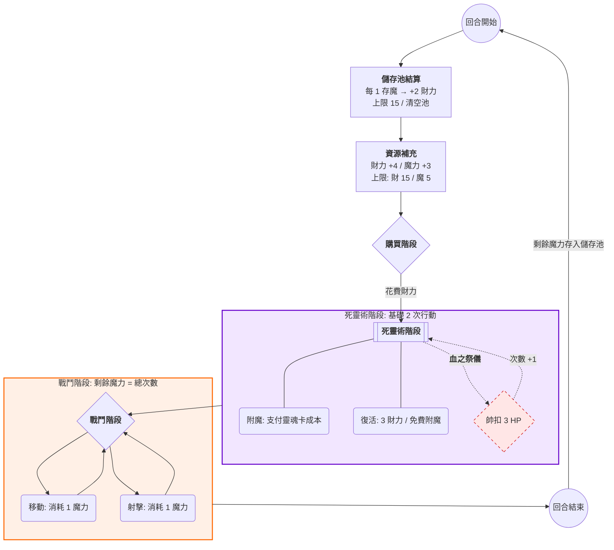

## 靈魂卡設計規章 v1.3（更新版）

### 核心精神
效果必須讓玩家一看當前狀態就知道強弱，盡量避免記憶「用過幾次」或「持續到何時」。

### 數值原則
- 所有數值必須為 **正整數**（1、2、3...）。
- **嚴禁** 任何小數點（0.5、1.5 等）。
- 小數效果改用放大倍率（每 2 屍減 1）、明確階梯（屍骸 ≥ 4 時 +2）或其他整數替代。

### 氏族常駐規則融入原則
- **所有氏族常駐規則必須寫進每張卡的「完整效果描述」** 中（開頭或結尾）。
- 玩家無需記憶氏族特性，一看單張卡就全懂。
- 同氏族內不同基底卡片，可根據基底強弱調整增益。

---

# 死靈召魂象棋 (Dead NecroChess)
2 人回合制策略桌遊（中國象棋變體 + 靈魂附魔系統 + HP 射擊戰鬥 + 屍骸資源循環）

## 遊戲目標
將對方帥（死靈法師）的生命值（HP）降低至 0 或以下。

## 遊戲組件
- 棋盤：標準 9×10 中國象棋棋盤。
- 棋子：紅黑雙方各 16 枚（帥x1、士x2、相x2、車x2、馬x2、砲x2、兵x5）。
- 靈魂卡：各氏族牌堆(挑選想要玩的氏族種類即可 建議3種氏族以上及30張牌以上)。
- 道具卡：道具牌堆。
- 資源：財力代幣、魔力代幣、屍骸標記、HP 追蹤器。

## 靈魂卡配置建議 (總數 40 張)

4個氏族當作基底靈魂卡池總共40張

## 回合流程圖 (簡易版)
1. **回合開始**：儲存池結算（魔力轉財力）→ 補充資源（財力+4, 魔力+3）。
2. **購買階段**：花費財力購買靈魂卡與道具卡。
3. **死靈術階段**：執行附魔、復活（基礎 2 次，可獻祭帥 3HP 額外獲得 +1 次）。
4. **戰鬥階段**：消耗魔力執行移動（1魔）或射擊（1魔）。
5. **回合結束**：剩餘魔力存入儲存池（上限 5）。

---

## 詳細階段規則

### 1. 回合開始階段
- **儲存池結算**：儲存池中每 1 點魔力轉換為 2 點財力（財力上限 15，超過丟棄），清空儲存池。
- **補充資源**：獲得財力 4 點與魔力 3 點（魔力上限 5）。

---

### 2. 購買階段 (Buying Phase)
- **展示區靈魂卡**：2 點財力。
- **隨機抽取**：1 點財力。
- **盜取靈魂卡(目標為對方墳場第一張)**：2 點財力。
- **道具卡**：依卡面標價。
---
## 一、 市場展示機制 (Marketplace)
為了增加戰術的條理化與預測性，遊戲採用「基底分選市場」。

### 1. 展示槽位分布
桌面上共設有 **7 個獨立展示槽位**：
* **【車/馬/砲/士/相】專區**：各公開展示 1 張靈魂卡。
* **【道具專區】**：公開展示 **3 張** 道具卡。

### 2. 玩家持有空間管理 (Player Storage)
玩家獲得的卡片必須根據類型存放在獨立空間，不可混用：
* **牢籠 (Cage)**：專供存放「靈魂卡」，上限 **5 張**。
* **道具欄 (Inventory)**：專供存放「道具卡」，上限 **3 張**。

### 3. 獲取方式與補貨規則
* **購買靈魂卡跟購買道具卡的次數分別一次**
* **精確購買 (2 財力)**：購買公開展示的靈魂卡。買走後立即從該牌堆翻開補位。
* **隨機招募 (1 財力)**：直接從該基底牌堆頂部「盲抽」一張靈魂卡。
* **盜取靈魂卡 (2 財力)**：購買敵方墳場「最上方」第一張靈魂卡（順序不可變更）。
* **道具購買**：依標價購買展示位道具卡。買走後立即補貨。

#### ⚠️ 溢出與限制處理：
1. **靈魂卡(牢籠)滿載**：若牢籠已達 5 張，**禁止**執行任何購買、盲抽或盜取靈魂卡的行動。玩家必須先執行「附魔」消耗卡片後方可購買。
2. **道具卡(道具欄)滿載**：若道具欄已達 3 張，玩家仍可購買新道具，但必須立即從手中或新購道具中**擇一棄置**至「道具棄牌堆」。
3. **資源枯竭**：若牌堆抽完，該展示位永久消失。後續僅能透過「盜取」或特定效果獲取該基

### 4. 靈魂歸還機制 (Soul Return)
於「購買階段」執行：
* **動作描述**：玩家可選擇「牢籠」中任一靈魂卡，將其置回對應基底牌堆的「最下方」。
* **成本代價**：
    1. **不退還財力**：玩家不會獲得任何購買該卡時的花費返還。
    2. **棄置限制**：每回合限歸還 **1 張** 靈魂卡。
* **戰術意義**：此動作旨在清空牢籠空間，以便進行新的「隨機招募」或「精確購買」，同時避免該卡進入墳場被對手盜取。

---

### 3. 死靈術階段 (Necromancy Phase)
本階段為強化陣容的核心，每回合基礎可執行 **2 次** 行動。

#### 核心規則：禁止活體覆蓋
* **靈魂唯一性**：一旦棋子完成附魔（活單位），在該單位死亡變為「屍骸」前，**不可**對其執行覆蓋附魔、更換或移除靈魂卡的動作。

#### 行動選項：
- **行動 A：附魔**：
    1. 選擇「牢籠」中一張靈魂卡，支付其召喚成本(財力)。
    2. 附魔至**無靈魂卡**的活棋子上。
    3. 數值重置（ATK/DEF/HP），保留棋子基底移動規則。
    4. **附魔補給**：附魔成功瞬間，該單位 HP 立即補滿至該靈魂卡上限。
- **行動 B：復活**：
    1. 花費 3 財力。
    2. 將 1 個己方屍骸復活至原位（目標格需無活單位）。
    3. **復活贈送**：復活後可立即執行 1 次**免費附魔**（不消耗死靈術行動次數，但仍需支付靈魂卡成本）。
- **血之祭儀**：每回合限 1 次。帥失去 3 點 HP（不可減免），本回合死靈術行動次數 +1。

### 補充規則：
* **強制剝離**：若欲更換活單位的靈魂卡，必須透過「單位戰死」、「主動獻祭」或「特定道具效果（如：亡者歸途）」將靈魂移除後，方可重新附魔。
* **道具增益**：若道具提供『額外死靈術動作』，不計入每回合 2 次的基礎限制。

---

### 4. 戰鬥階段 (Combat Phase)
#### 行動次數由當前魔力點數決定，動作需拆分計費：
- **移動（消耗 1 魔力）**：執行一次基底規則移動。
- **射擊（消耗 1 魔力）**：執行一次射程內射擊。
- **傷害公式**：1d6 + ATK - 對方 DEF（最低為 1）。
- **阻擋規則**：所有「活單位」皆會阻擋射線
例外條款：「除『砲』基底單位具備『隔子射擊』特性外，其餘單位不可跨越活單位進行射擊。（除非卡片另有說明）。」
#### 戰鬥結算與單位損毀
當一個單位的 HP 降低至 0 或以下時，按以下步驟處理：

1. **遺產留下**：
    * 在該棋子所在格子留下一個「**屍骸標記**」（歸屬於原擁有者）。
    * 棋子本體（基底）移出場外，等待復活。
2. **靈魂剝離**：
    * 若該單位有附魔，將其上的「**靈魂卡**」移除。
    * **重要：** 靈魂卡必須 **正面朝上** 放置於該棋子原擁有者的「**墳場最上方**」。
3. **墳場順序**：
    * 墳場內的卡片順序不可私自更動，只有最上方第一張可被「購買階段」的盜取行動影響，或被特定道具卡觸發。

---

#### 戰術意義說明（開發者備註）：
* **擊殺者的獲利**：當你擊殺對方的強大靈魂（例如對方的「車」），該卡會立即進入對方墳場頂端。你下一回合即可在購買階段花 2 財力「盜取」該卡，形成「擊殺並奪魂」的連鎖。
* **被擊殺者的防禦**：若玩家預見對方想搶奪特定靈魂，可在購買階段透過隨機抽牌或棄置手中多餘卡片至墳場，利用「覆蓋」機制保護下層的強大靈魂。
* **復活的限制**：由於附魔卡已進墳場，復活行動預設只能復活出「基礎單位」或「屍骸戰士」。除非玩家手中仍有備用靈魂卡，或利用復活階段的「免費附魔」搭配牢籠卡片進行重塑。

---
## 基礎單位戰鬥力（未附魔）

| 棋子 | HP | ATK | DEF (物/魔) | 射擊範圍 | 移動方式 |
| :--- | :--- | :--- | :--- | :--- | :--- |
| **帥** | 15 | 1 | 2 / 2 | 宮內 1 格 | 宮內直橫斜 |
| **士** | 10 | 1 | 1 / 1 | 宮內斜 1 格 | 宮內斜走 |
| **相** | 10 | 1 | 1 / 1 | 田字範圍 | 田字不過河 |
| **車** | 10 | 2 | 1 / 0 | 直線無限 | 直線移動 |
| **馬** | 10 | 2 | 1 / 0 | 日字範圍 | 日字跳 |
| **砲** | 10 | 2 | 0 / 1 | 隔子射擊 | 直線移動 |
| **兵** | 8 | 1 | 0 / 0 | 前方 1 格 | 往前(過河可橫移) |

---
# 卡表:

# 暗月影刃氏族（物理機動，10張）

### 暗月影刃氏族整體影像風格（美術設定）

暗月影刃氏族是永夜邊境的影之暗殺者家族，全員為冷豔優雅的亡靈美少女刺客。  
**共通視覺風格**：  
月光藍紫色調為主，冷白肌膚、銀藍或深紫長髮（直髮、馬尾、微捲），眼神銳利帶殺意卻優雅迷人。身穿緊身黑紫影甲或半透刺客和服，腰間配影刃或鐮刀，飾以月影與亡靈花紋。背景永遠有淡淡月光、飄浮魂火與薄霧，表情多為冷靜微笑或側臉凝視。  
整體給人「高雅卻致命」的二次元哥德風，細膩光影、高細節、kawaii gothic fantasy anime style，豎版立繪，無背景人物。

### 暗月影刃氏族成員人設特徵（美術參考用）

| 名     | 詳細人設美術描述 |
|--------|------------------|
| 蘭華   | 家族長女，黑長直髮至腰，冷白肌膚，銀灰眼眸，穿著高領緊身黑紫影甲，右手持巨型月刃，表情冷靜高傲，腰間掛著數枚魂火吊飾，姿態挺拔優雅。 |
| 影華   | 銀白短髮微亂，蒙面只露紫眸，穿輕薄貼身刺客服，肩甲有月影刻紋，手持雙短刃，體態纖細敏捷，常以側身低頭姿態出現。 |
| 櫻紫   | 紫色雙馬尾，髮尾綴櫻花瓣魂火，粉紫眼眸，穿露肩短版影甲，笑容甜美卻帶殺氣，左手持彎刃，姿態活潑輕盈。 |
| 舞影   | 銀藍長捲髮隨風飄揚，淡金眼眸，穿半透紗質刺客長袍，腳踏輕盈舞步，手持細長影鞭，給人優雅如風中幽靈的感覺。 |
| 夜華   | 藍黑長直髮遮右眼，深紅眼眸，穿重甲炮手風格影袍，背負巨型影炮，表情冷酷，站姿穩重，散發孤高氣質。 |
| 風華   | 翠綠短髮，風吹般凌亂，碧綠眼眸，穿輕盈流蘇影衣，手持旋風刃，動作總帶風壓殘影，自由不羈的少女姿態。 |
| 夜姬   | 粉色及腰長髮，溫柔紫眸，穿宮廷守護風格的華麗影甲，胸前有月輪徽記，表情溫柔卻帶堅定，母性與殺手氣質並存。 |
| 影姬   | 金色雙馬尾，機靈金眸，穿可愛侍女刺客裝，短裙配短刃，笑容俏皮，動作靈活，常以半蹲準備反刺的姿態。 |
| 月姬   | 銀藍長直髮，月光般透亮肌膚，淡藍眼眸，穿月華流蘇長袍，手持斜刃，過河後全身散發淡淡月光粒子，夢幻而危險。 |
| 幽姬   | 紫黑長髮遮住半邊臉，深紫眼眸，穿最神秘的暗影長袍，嘴角永遠帶著淺笑，雙手藏在袖中，給人深不可測的感覺。 |

# 🌙 暗月影刃氏族 (Dark Moon Blade)

**氏族定位**：物理機動刺客。擅長透過「越境（過河）」觸發強力的位移與無視阻擋效果。
**戰鬥風格**：高機動、單點暗殺、內政防禦反擊。

### 📌 關鍵術語定義 (暗月篇)
* **【越境】**：當單位處於敵方半場時觸發的效果。
* **【忽略阻擋】**：射擊時，射線路徑上的「活單位」不計入阻擋點（砲基底則視為不需隔子即可射擊，或隔子不被擋）。
* **【總 HP】**：包含棋子基底與靈魂卡加成後的最終生命值。
* **【附魔補給】**：附魔成功瞬間，該單位 HP 立即補滿至「總 HP」上限。
* **【宮內】**：指己方棋盤最底部的 3x3 區域（即「九宮」）。
* **【共鳴】**：場上存在指定數量的同氏族單位時，開啟的被動光環。
* **【反擊】**：在非自身行動回合，因特定條件觸發的立即傷害動作。

---

### 🌙 暗月影刃氏族卡表 (v1.07)

| 基底 | 名稱 | 召喚成本(財力) | ATK | DEF (物/魔) | **總 HP** | 完整效果描述 |
|:---:|:---:|:---:|:---:|:---:|:---:|:---|
| **車** | 蘭華 | 6 | 物理 3 | 1/1 | **12** | **【越境】**：射擊忽略 1 個阻擋；若自身附近 2 格內敵方 ≥ 2，則忽略所有阻擋。 |
| **車** | 影華 | 7 | 物理 2 | 1/0 | **12** | **【越境】**：射擊忽略所有阻擋。 |
| **馬** | 櫻紫 | 6 | 物理 2 | 1/0 | **10** | **【越境】**：執行「移動」後，可額外執行一次「射擊」（本回合限 1 次）。 |
| **馬** | 舞影 | 5 | 物理 2 | 1/0 | **9** | **【越境】**：執行「移動」時忽略所有路徑阻擋（不被「拐馬腳」）。 |
| **砲** | 夜華 | 6 | 物理 2 | 0/1 | **9** | **【越境】**：射擊產生「濺射」，目標格相鄰 1 格的敵方受到同等傷害（本回合限 1 次）。 |
| **砲** | 風華 | 5 | 物理 2 | 0/1 | **9** | **【越境】**：射擊傷害 +1。 |
| **士** | 夜姬 | 4 | 物理 1 | 1/1 | **8** | **【宮內】**：己方單位射擊忽略 1 個阻擋（本回合限 1 次）；若宮內己方單位 ≥ 2，可替受攻擊友軍分擔 1 點傷害。 |
| **士** | 影姬 | 4 | 物理 2 | 1/1 | **8** | **【反擊】**：若「帥」受到傷害，影姬立即對攻擊者造成 1d6 物理傷害（本回合限 1 次）。 |
| **相** | 月姬 | 4 | 物理 2 | 1/1 | **8** | **【共鳴】**：場上己方「暗月」單位 ≥ 4，所有己方「越境」單位傷害 +1。 |
| **相** | 幽姬 | 5 | 物理 2 | 1/1 | **9** | **【共鳴】**：場上己方「暗月」單位 ≥ 4，所有己方「越境」單位射擊忽略 1 個阻擋（本回合限 1 次）。 |

---
# 冥河焰巫血脈（魔法範圍，10張）

### 冥河焰巫氏族整體影像風格（美術設定）

冥河焰巫氏族是亡靈中的焰火女巫家族，居住在冥河彼岸的火焰沼澤。她們以魔法範圍攻擊聞名，火焰與冥雷交織，象徵毀滅與重生。  
**共通視覺風格**：  
紅黑與深紫色調為主，蒼白肌膚帶火焰紋路，長髮飄浮如焰（紅/橙/紫漸層），眼眸燃燒著冥火。身穿露肩法袍或火焰披風，飾以冥河符文與魂火寶石，手持法杖/焰球/雷珠。背景為燃燒的冥河、飄浮火魂與黑霧，表情自信魅惑帶危險感。  
整體給人「狂野卻優雅」的二次元火焰哥德風，高細節光影、火焰粒子特效、kawaii dark fantasy anime style，豎版立繪，無背景人物。

### 冥河焰巫氏族成員人設特徵（美術參考用）

| 名       | 詳細人設美術描述 |
|----------|------------------|
| 緋焰     | 紅髮如烈焰的長女，火紅眼眸，穿露肩火焰長袍，左手持燃燒法杖，右手浮動焰球，姿態自信張揚，背後飄浮冥河火紋。 |
| 冥焰車   | 深紫黑長髮纏繞暗紅火焰，冥焰紫眸，穿緊身冥焰法衣，背後浮現扭曲焰輪，表情冷傲，身上殘留車輪火痕。 |
| 焰靈     | 橙色雙馬尾少女，活潑金橙眼眸，穿短版火焰裙甲，雙手環繞火靈，笑容燦爛卻帶毀滅氣息，馬尾末端燃燒小火苗。 |
| 血焰     | 深紅長捲髮，血紅眼眸，穿血焰披風，手持滴血焰劍，姿態優雅殘酷，嘴角常掛微笑，劍刃上流動冥河血焰。 |
| 爆焰     | 粉紅短髮，爆裂橙眸，穿爆炸符文法袍，手持爆焰球，動作誇張，總像要引爆一切，袍子上刻滿爆裂火焰符文。 |
| 冥雷砲   | 銀紫長直髮，雷光藍眸轉為暗焰藍，穿雷霆長袍改為冥焰長袍，背後浮現冥焰巨眼，氣質高冷神秘，炮口溢出紫紅火焰。 |
| 冥護     | 暗紫長髮，護盾紫眸，穿守護法袍，手持冥盾，溫柔卻堅定，盾上刻滿冥河符文，周身環繞淡紫防護焰。 |
| 焰侍     | 黑紅漸層長髮，侍衛紅眸，穿輕甲火焰侍袍，手持焰盾與短劍，姿態忠誠護衛，盾牌燃燒小火花。 |
| 焰靈相   | 橙紫漸層長髮，靈火金眸，穿輕靈火焰長裙，雙手浮動火蝶，姿態夢幻而危險，裙擺如焰靈飄浮。 |
| 冥焰相   | 紫黑長髮纏繞冥焰，冥焰紫眸，穿優雅冥焰長袍，雙手浮動暗紅火環，氣質冷靜危險，袍袖繡滿冥河火焰紋。 |

# 🔥 冥河焰巫血脈 (Styx Flame Witches)

**氏族定位**：魔法火力爆發。全成員具備魔法 ATK，擅長範圍【連鎖】與多目標【貫穿】。
**戰鬥風格**：中後場壓制、多點同時打擊、高魔防陣地。

### 📌 關鍵術語定義 (冥河篇)
* **【連鎖】**：射擊命中後，火焰彈跳至目標格相鄰 1 格的另一敵方單位，造成同等傷害。
* **【貫穿】**：射擊命中後，火焰燒毀路徑上指定的 N 個目標（通常包含阻擋者與最終目標）。
* **【冥雷】**：射擊結算前，目標之「魔防 DEF」暫時 -1（最低為 0）；若目標處於「越境」狀態，傷害額外 +1。
* **【冥河回補】**：此單位擊殺敵方後，立即為己方「帥」回復 1 點 HP（不可超過最大上限）。
* **【總 HP】**：此數值已包含棋子基底與靈魂卡加成，為該單位當前生命上限。
* **【防護】**：光環效果。使指定區域內的友軍獲得額外的 DEF 加成。

---

### 🔥 冥河焰巫血脈卡表 (v1.15 Final)

| 基底 | 名稱 | 召喚成本(財力) | ATK | DEF (物/魔) | **總 HP** | 完整效果描述 |
|:---:|:---:|:---:|:---:|:---:|:---:|:---|
| **車** | 緋焰 | 6 | 魔法 3 | 0/2 | **12** | **【連鎖】**：射擊時，可額外選擇目標格相鄰 1 格的另一敵方，造成同等傷害（每回合限 1 次）。 |
| **車** | 冥焰車 | 7 | 魔法 3 | 0/1 | **13** | **【貫穿】**：射擊路徑上包含目標在內的「前 2 個敵方單位」均受到同等傷害。 |
| **馬** | 焰靈 | 7 | 魔法 3 | 0/2 | **10** | **【連鎖】**：射擊時，可額外選擇目標格相鄰 1 格的另一敵方，造成同等傷害（每回合限 1 次）。 |
| **馬** | 血焰 | 6 | 魔法 2 | 0/2 | **10** | **【冥河回補】**：此單位擊殺敵方後，立即為己方「帥」回復 1 點 HP。 |
| **砲** | 爆焰 | 7 | 魔法 3 | 0/1 | **10** | **【貫穿】**：隔子射擊時，作為砲架（阻擋者）的敵方與目標敵方均受到同等傷害。 |
| **砲** | 冥雷砲 | 8 | 魔法 4 | 0/1 | **11** | **【冥雷】**：射擊時目標魔防 -1（最低為 0）；且對處於「越境」狀態的敵方額外 +1 傷害。 |
| **士** | 冥護 | 4 | 魔法 1 | 0/3 | **8** | **【防護(物理)】**：當自身處於「宮內」時，所有「宮內」己方單位物防 DEF +1。 |
| **士** | 焰侍 | 4 | 魔法 2 | 0/3 | **8** | **【防護(魔法)】**：當自身處於「宮內」時，所有「宮內」己方單位魔防 DEF +1。 |
| **相** | 冥雷相 | 6 | 魔法 3 | 0/2 | **9** | **【冥雷】**：射擊時目標魔防 -1（最低為 0）；且對處於「越境」狀態的敵方額外 +1 傷害。 |
| **相** | 冥焰相 | 5 | 魔法 2 | 0/2 | **9** | **【冥河回補】**：此單位擊殺敵方後，立即為己方「帥」回復 1 點 HP。 |

---
# 永夜骸骨家族（屍骸buff，10張）

### 永夜骸骨家族整體影像風格（美術設定）

永夜骸骨氏族的士族是亡靈中的守護骨巫家族，駐守在永夜墓園的骨之聖殿。她們以防護與反擊聞名，骨盾與魂霧交織，象徵堅守與報復。
**共通視覺風格**：
黑灰與骨白色調為主，蒼白肌膚帶細碎骨紋與幽綠光暈，長髮如枯骨飄浮（灰白/淡綠/暗紫漸層），眼眸空洞發出幽綠或血紅光芒。身穿破碎哥德骨袍或輕甲侍衛裝，飾以鐵鏈、骷髏吊墜與冥骨符文，手持巨骨盾/短骨劍/魂霧寶珠。背景為陰森墓園、飄浮小骷髏與淡綠霧氣，表情溫柔堅定卻帶詭異微笑。
整體給人「陰森卻忠誠」的二次元骸骨哥德風，高細節光影、幽魂粒子特效、kawaii dark fantasy anime style，豎版立繪，無背景人物。

### 永夜骸骨家族 - 人設美術描述（全新設計）

| 名       | 詳細人設美術描述 |
|----------|------------------|
| 骨華     | 銀灰長直髮如枯骨，空洞綠眸，穿破碎骨白哥德長裙，頭戴小型骨冠，雙手浮動幽綠骨鏈，姿態優雅冷漠，裙擺拖出小骷髏影子。 |
| 冥骨車   | 黑白漸層長髮，紅光骨眸，穿重型骨甲法袍，肩扛巨骨車輪法杖，表情狂野，背後浮現亡靈車軌，身上纏繞鐵鏈骨頭。 |
| 魂靈     | 淡綠雙馬尾少女，發光紫眸，穿輕盈骨蕾絲短裙，雙手環繞小幽魂，笑容甜美卻帶死亡氣息，馬尾末端飄浮骨頭珠。 |
| 血骨     | 深紅捲髮，血紅眼眸，穿血染骨披風，手持滴血骨劍，姿態殘酷優雅，嘴角微笑，劍刃上爬滿小骷髏。 |
| 碎骨     | 粉灰短髮，爆裂橙綠眸，穿爆炸骨符文法袍，手持碎骨球，動作誇張，總像要炸開骨頭，袍子上滿是裂紋骨頭圖案。 |
| 冥骨砲   | 銀黑長直髮，暗綠骨眸，穿炮手骨袍，肩扛巨型骨炮，氣質高冷，炮口溢出綠色幽魂霧氣，背後浮現骷髏巨眼。 |
| 骨護     | 暗灰長髮，護盾綠眸，穿守護骨袍，手持巨骨盾，溫柔堅定，盾上刻滿亡靈符文，周身環繞淡綠防護骨霧。 |
| 魂侍     | 黑白漸層長髮，侍衛紅眸，穿輕甲骨侍袍，手持骨盾與短骨劍，姿態忠誠，盾牌上飄浮小骷髏精靈。 |
| 骨靈相   | 灰紫漸層長髮，靈骨綠眸，穿輕靈骨長裙，雙手浮動骨蝶，姿態夢幻危險，裙擺如幽魂飄浮。 |
| 冥骨相   | 紫黑長髮纏繞骨霧，冥骨紫眸，穿優雅冥骨長袍，雙手浮動暗紅骨環，氣質冷靜詭異，袍袖繡滿骷髏紋路。 |

# 💀 永夜骸骨家族 (Eternal Night Bones)

**氏族定位**：墓地資源與全場增益。核心依賴「己方屍骸」數量觸發全體強化。
**戰鬥風格**：犧牲獻祭、死後反撲、強效保命、全場光環壓制。

---

### 📌 關鍵術語定義 (永夜篇)
* **【屍氣】**：場上己方「屍骸標記」的總數量。達到門檻時自動解鎖階梯效果。
* **【獻祭】**：己方回合開始時，可主動摧毀一個己方「活單位」，將其變為「屍骸」並立即獲得特定效果。
* **【冥土歸還】**：當單位死亡變為屍骸時，立即對「目標格」及其「相鄰 1 格」敵方造成 3 點物理傷害。
* **【永夜血脈】**：全場光環。當滿足屍氣門檻時，提升「全場」己方永夜單位（不含帥）的特定數值。
* **【免費】**：執行指定動作（射擊/移動）時，不消耗玩家本回合的行動次數或魔力。
* **【連鎖】**：射擊命中後，火焰/骨片彈跳至目標格相鄰 1 格的另一敵方單位，造成同等傷害。

---

### 💀 永夜骸骨家族卡表 (v1.22)

| 基底 | 名稱 | 召喚成本(財力) | ATK | DEF (物/魔) | **總 HP** | 完整效果描述 |
|:---:|:---:|:---:|:---:|:---:|:---:|:---|
| **車** | 骨華 | 6 | 物理 3 | 1/1 | **12** | **【屍氣】**：≥ 3 時獲得 **【貫穿】** (前 2 個敵方)；≥ 6 時，射擊傷害額外 +2。 |
| **車** | 冥骨車 | 7 | 物理 3 | 1/0 | **12** | **【獻祭】**：射擊前摧毀 1 格內友軍，本次射擊獲得 **【無視阻擋】** 且傷害根據目前屍骸數 +1 (上限 +4)。 |
| **馬** | 魂靈 | 7 | 魔法 3 | 0/2 | **10** | **【獻祭】**：移動後摧毀 1 格內友軍，可執行 **【連鎖】** 射擊。 |
| **馬** | 血骨 | 6 | 物理 2 | 1/1 | **10** | **【冥土歸還】**：此單位死亡時觸發。**【屍氣】**：≥ 3 時獲得「移動後射擊」效果。 |
| **砲** | 碎骨 | 7 | 物理 3 | 0/1 | **9** | **【冥土歸還】**：此單位死亡時觸發。**【屍氣】**：≥ 3 時射擊獲得 **【連鎖】** 效果。 |
| **砲** | 冥骨砲 | 8 | 魔法 4 | 0/1 | **10** | **【屍氣】**：≥ 4 時傷害 +1；每存在 2 具屍骸，射擊目標之「魔防 DEF」-1。 |
| **士** | 骨護 | 4 | 物理 1 | 2/2 | **8** | **【永夜血脈(物理)】**：屍氣 ≥ 3 時全場永夜單位物防 +1。**【獻祭】**：摧毀自身使「帥」無敵 1 回合。 |
| **士** | 魂侍 | 4 | 魔法 2 | 1/2 | **8** | **【永夜血脈(魔法)】**：屍氣 ≥ 3 時全場永夜單位魔防 +1。**【獻祭】**：摧毀自身使「帥」無敵 1 回合。 |
| **相** | 骨靈相 | 5 | 魔法 2 | 0/3 | **9** | **【屍氣】**：≥ 3 時獲得 **【無視阻擋】** 1 個；≥ 5 時，執行射擊變為 **【免費】**（限 1 次）。 |
| **相** | 冥骨相 | 6 | 物理 3 | 1/2 | **9** | **【冥土歸還】**：此單位死亡時觸發。**【永夜血脈(攻)】**：每 2 具屍骸提升全場永夜單位物理傷害 +1。 |

---

---
# 鐵衛軍魂家族（兵團buff，10張）

### 鐵衛軍魂家族整體影像風格（美術設定）
鐵衛軍魂家族是亡靈中的鐵血軍師家族，統御無數凡兵魂魄，駐守在鐵血要塞的兵魂殿堂。他們以強化士兵聞名，鐵甲與軍魂交織，象徵忠誠與無畏推進。
**共通視覺風格**：
綠灰與鐵黑為主，蒼白肌膚帶鐵甲紋路，長髮如軍旗飄揚（灰綠/鐵灰漸層），眼眸閃耀鋼鐵綠光。身穿軍裝哥德蘿莉塔或鐵甲披風，飾以兵魂徽章、鐵鏈與軍旗，手持鐵杖/兵魂旗/軍號。背景為鐵血軍營、飄浮兵魂與灰霧，表情嚴肅忠誠帶戰意。
整體給人「鐵血卻可愛」的二次元軍魂哥德風，高細節光影、兵魂粒子特效、kawaii military fantasy anime style，豎版立繪，無背景人物。

### 鐵衛軍魂家族 - 人設美術描述

| 名       | 詳細人設美術描述 |
|----------|------------------|
| 軍華     | 灰綠長直髮如軍旗，鋼鐵綠眸，穿鐵甲軍裝長袍，手持燃燒鐵旗，姿態自信指揮，背後飄浮兵魂軍團。 |
| 鐵車     | 鐵黑長髮纏繞綠焰，鐵眸冷峻，穿重型鐵車法衣，肩扛巨鐵車輪，表情堅定，車輪上刻滿兵魂符文。 |
| 騎兵靈   | 綠灰雙馬尾少女，靈動綠眸，穿輕騎兵裝裙甲，雙手環繞兵魂馬靈，笑容英氣，馬尾末端飄鐵鏈。 |
| 聯骨馬   | 深灰捲髮，聯軍紅綠眸，穿聯手鐵披風，手持骨鐵長槍，姿態協同作戰，槍刃爬滿小兵魂。 |
| 炮兵華   | 灰綠短髮，炮火綠眸，穿炮兵符文軍袍，手持爆鐵炮球，動作果敢，袍子上滿鐵甲裂紋。 |
| 爆兵砲   | 鐵黑長直髮，爆裂綠眸，穿重砲鐵袍，肩扛巨爆兵炮，氣質高傲，炮口溢出綠色兵魂霧氣。 |
| 軍護     | 暗灰長髮，護盾綠眸，穿守護鐵袍，手持巨鐵盾，溫柔堅定，盾上刻滿軍魂符文。 |
| 召侍     | 綠灰漸層長髮，召喚綠眸，穿輕甲召喚侍袍，手持召兵號角，姿態忠誠，號角周身兵魂環繞。 |
| 軍靈相   | 灰綠漸層長髮，軍靈綠眸，穿輕靈鐵長裙，雙手浮動兵魂蝶，姿態夢幻戰意，裙擺如軍旗飄揚。 |
| 鐵骨相   | 鐵黑長髮纏繞骨霧，鐵骨綠眸，穿優雅鐵骨長袍，雙手浮動綠鐵環，氣質冷靜無畏，袍袖繡滿兵魂紋。 |

# ⚔️ 鐵衛軍魂家族 (Ironclad Legion)

**氏族定位**：兵海壓制與陣地連攜。核心依賴場上「己方活兵（卒）」的數量觸發強化。全成員具備物理 ATK。
**戰鬥風格**：高頻復活、兵海推進、步騎協同、後勤補給。

# 鐵衛軍魂家族卡表 (v1.22 改進版)

## 改進計畫總結
1. **強化士定位**：新增【宮護】基礎能力，讓士在宮內保護帥時減傷 1 點（每回合限 1 次），解決士太弱問題。
2. **統一軍勢門檻**：從 ≥3 開始有明顯效果，≥5 更強，強化兵團堆疊感。
3. **鐵衛整體定位**：強調「防守反擊 + 兵團再生」，前期穩守、中後期爆發。
4. **平衡調整**：高成本卡效果更強，低成本卡支援性提升，預計勝率從 7.3% 拉到 14\~16%。
5. **格式優化**：每張卡效果更直觀，關鍵字粗體標記，總 HP 明確標示。

## 關鍵術語定義 (鐵衛篇)
- **【軍勢】**：場上己方「卒（兵）」的總活體數量。達到門檻時立即解鎖效果。
- **【軍援】**：特殊攻擊。射擊時，若目標格相鄰 1 格內有己方「卒」，該「卒」立即對目標追加一次傷害判定（需計算目標 DEF，並消耗該卒本回合攻擊次數）。
- **【整編】**：特殊動作。消耗 1 點魔力，立即將場上一具己方「卒」的屍骸於原地復活。
- **【宮護】**：基礎能力。士在宮內時，帥被攻擊時減傷 1 點（每回合限 1 次）。
- **【免費】**：執行指定動作（射擊/移動）時，不消耗玩家本回合的行動次數或魔力。
- **【無視阻擋】**：射擊時，射線路徑上的「活單位」不計入阻擋點。
- **【總 HP】**：包含棋子基底與靈魂卡加成後的最終生命值。

## 鐵衛軍魂家族卡表

| 基底 | 名稱     | 召喚成本(財力) | ATK     | DEF (物/魔) | 總 HP | 完整效果描述                                                                                           |
|------|----------|----------------|---------|-------------|-------|--------------------------------------------------------------------------------------------------------|
| 車   | 軍華     | 6              | 物理 3  | 1/0         | 12    | **【軍勢】**：卒 ≥ 3 時傷害 +1；≥ 5 時傷害 +2。 **【軍援】**：射擊時可聯動目標相鄰 1 格內的「卒」進行追加攻擊。 |
| 車   | 鐵車     | 7              | 物理 3  | 1/1         | 12    | **【軍勢】**：卒 ≥ 3 時獲得 【無視阻擋】；≥ 5 時，執行射擊變為 【免費】 (每回合限 1 次)。                   |
| 馬   | 騎兵靈   | 7              | 物理 3  | 1/0         | 10    | **【軍援】**：射擊時可聯動目標相鄰 1 格內的「卒」進行追加攻擊；若擊殺敵人，聯動的「卒」可立即移動 1 格。 |
| 馬   | 聯軍馬   | 6              | 物理 2  | 1/0         | 10    | **【軍勢】**：卒 ≥ 3 時獲得「移動後射擊」；自身周圍 1 格每多 1 個卒，傷害額外 +1 (上限 +2)。           |
| 砲   | 炮兵華   | 7              | 物理 3  | 0/1         | 10    | **【軍勢】**：卒 ≥ 3 時獲得 【連鎖】 (彈跳 1 次)；≥ 5 時，射擊傷害額外 +1。                               |
| 砲   | 爆兵砲   | 8              | 物理 4  | 0/1         | 10    | **【軍勢】**：卒 ≥ 4 時獲得 【無視阻擋】；≥ 5 時，對「宮內」目標傷害額外 +1。                             |
| 士   | 軍護     | 4              | 物理 1  | 1/2         | 8     | **【整編】**：召喚此卡時免費執行一次。每回合可選 1 卒使其移動力 +1 (過河前可走 2 格或橫移)。 **【宮護】**：宮內時，帥被攻擊時減傷 1 點 (每回合限 1 次)。 |
| 士   | 召侍     | 4              | 物理 2  | 1/1         | 8     | **【後勤】**：戰鬥階段可消耗 1 魔力執行 【整編】，復活場上一具「卒」之屍骸。 **【宮護】**：宮內時，帥被攻擊時減傷 1 點 (每回合限 1 次)。 |
| 相   | 軍靈相   | 5              | 物理 2  | 0/2         | 9     | **【軍勢】**：卒 ≥ 3 時，全場單位ATK +1；≥ 5 時，ATK 改為 +2。                                         |
| 相   | 鐵骨相   | 6              | 物理 2  | 0/2         | 9     | **【軍勢】**：卒 ≥ 3 時，全場單位受傷 -1；≥ 5 時，受傷 -2 (最低為 0)。                                 |

---

# 道具卡清單 (v1.4 重構最終版)

**時機定義：**
* **【購買】**：於購買階段執行。
* **【死靈】**：於死靈術階段執行。
* **【戰鬥】**：於戰鬥階段開始前、或執行「移動/射擊」動作時執行。

| 編號 | 名稱 | 成本 | 發動時機 | 效果描述 | 建議配率 |
| :--- | :--- | :---: | :---: | :--- | :---: |
| 1 | **靈血聖杯** | 3 | **【購買】** | **修復**：選擇 1 個己方單位（含帥），恢復 4 點 HP（不超過上限）。 | **4** |
| 2 | **魂能超載** | 4 | **【戰鬥】** | **動作**：本回合獲得 1 次免費「射擊」。該動作不可由本回合已執行射擊的單位使用。 | **3** |
| 3 | **骸骨煉化** | 4 | **【購買】** | **轉化**：移除場上 1 個己方屍骸，選擇獲得 3 點財力或 2 點魔力。 | **3** |
| 4 | **暗月窺視鏡** | 3 | **【購買】** | **盜取**：本回合執行「盜取」時，可改為選擇敵方墳場「任意一張」靈魂卡。 | **2** |
| 5 | **死戰契約** | 5 | **【死靈】** | **鋪場**：立即執行 1 次不計入上限的「復活」，但該單位本回合不可附魔。 | **2** |
| 6 | **冥魂灌注** | 6 | **【死靈】** | **爆發**：立即獲得 +1 次「死靈術」動作，且本次執行「附魔」時成本 -1 財力。 | **2** |
| 7 | **靈魂收割者** | 5 | **【戰鬥】** | **掠奪**：本回合內擊殺附魔單位時，獲得 1 點魔力，且免財力將該靈魂卡納入己方牢籠。 | **2** |
| 8 | **死亡連鎖** | 7 | **【戰鬥】** | **殺戮**：本回合每擊殺一個單位立即回復 1 點魔力。本效果單回合最多觸發 **3 次**。 | **1** |
| 9 | **冥鎖封印** | 6 | **【戰鬥】** | **控制**：選擇 1 個敵方單位，使其本回合無法執行移動與射擊動作。 | **1** |
| 10 | **牢籠掠奪** | 6 | **【購買】** | **干擾**：隨機查看並奪取敵方牢籠 1 張靈魂卡（若滿則擇一棄置至墳場）。 | **1** |
| 11 | **棘荊領域** | 5 | **【戰鬥】** | **陣地**：本回合敵方進入己方半場後，每移動 1 格需額外消耗 1 魔力。 | **1** |
| 12 | **靈魂剝離針** | 5 | **【死靈】** | **弱化**：選 1 敵方附魔單位，對手選將卡收回牢籠或棄置；該單位回復至滿 HP 狀態回歸初始狀態。 | **1** |
| 13 | **亡者歸途** | 4 | **【死靈】** | **保護**：選擇 1 個己方附魔單位，將靈魂卡收回牢籠。該單位回復至滿 HP 狀態回歸初始狀態。 | **2** |
| 14 | **法師的貪婪** | 3 | **【購買】** | **洗牌**：將展示區「所有」靈魂展示位卡片置於各牌堆底部，並全部翻開新卡。 | **1** |
| 15 | **靈魂觀星儀** | 5 | **【購買】** | **檢索**：檢視任一基底牌堆頂 3 張，將其中 1 張置入牢籠，其餘依序放回。 | **1** |
| 16 | **冥界稅收** | 5 | **【購買】** | **壓制**：本回合內，敵方執行「死靈術（復活或附魔）」的財力成本 +2。 | **1** |

---
# 💀 死靈召魂象棋 (Dead NecroChess) 玩家快速參照手冊 v1.3

---

## 🕒 回合流轉速查
1. **回合開始**：魔力轉財力（1:2） -> 補充資源（財力+4, 魔力+3）。
2. **購買階段**：
    * **精確購買** (2 財力)：買展示位卡片。
    * **隨機招募** (1 財力)：從對應基底牌堆盲抽。
    * **盜取靈魂** (2 財力)：買對方墳場第一張卡。
3. **死靈術階段** (基礎 2 次行動)：
    * **附魔**：支付卡片成本，強化棋子並補滿 HP。
    * **復活** (2 財力)：復活屍骸至原位，附贈 1 次免費附魔。
    * **血之祭儀** (限 1 次)：帥扣 3 HP，死靈術次數 +1。
4. **戰鬥階段** (1 魔力 = 1 動作)：執行移動或射擊。
5. **回合結束**：剩餘魔力存入儲存池（上限 5）。

---

## ⚔️ 氏族特性精華
| 氏族 | 核心機制 | 關鍵字定義 |
| :--- | :--- | :--- |
| **🌙 暗月影刃** | 越境暗殺 | **【越境】**：在敵方半場觸發強效增益。 |
| **🔥 冥河焰巫** | 魔法貫穿 | **【貫穿】**：一次射擊對路徑多個目標造成傷害。 |
| **💀 永夜骸骨** | 屍骸光環 | **【屍氣】**：依場上己方屍骸數量解鎖階段強化。 |
| **⚔️ 鐵衛軍魂** | 兵海推進 | **【軍勢】**：依場上活「卒」數量強化全軍。 |

---

## ❓ 規則 FAQ (常見問題解答)

**Q1：如果我的棋子被擊殺，附魔的靈魂卡去哪裡？**
* **A**：靈魂卡會立即剝離，並「正面朝上」放置於擁有者的墳場最上方。請注意，墳場順序不可更動，這會影響對方的「盜取」行動。

**Q2：「復活」後可以馬上移動或射擊嗎？**
* **A**：可以。復活與附魔發生在「死靈術階段」，而移動與射擊是在隨後的「戰鬥階段」執行。只要你有足夠的魔力，剛復活的單位完全可以立即投入戰鬥。

**Q3：「隔子射擊」與「無視阻擋」有什麼區別？**
* **A**：
    * **隔子射擊**（砲基底）：必須中間隔著一個單位（砲架）才能射擊。
    * **無視阻擋**：射線路徑上的活單位不計入阻擋點，直接命中目標。

**Q4：我可以對同一個「存活」的單位重複附魔嗎？
* **A**：絕對不行。靈魂與肉體的結合是神聖且唯一的。
* **規則詳述**：
    1. **鎖定狀態**：一旦棋子被附魔（處於「活單位」狀態），在該單位死亡變為「屍骸」前，不可更換、覆蓋或移除其靈魂卡。
    2. **更換途徑**：若想為該基底更換靈魂，必須滿足以下任一條件：
        * **單位戰死**：單位 HP 歸零變為屍骸，靈魂卡進入墳場，隨後重新執行「復活」與「附魔」。
        * **主動獻祭**：利用氏族特性（如永夜的【獻祭】）或道具卡主動摧毀該單位。
        * **特定道具**：使用如「亡者歸途」等道具卡，強行將靈魂剝離回牢籠。

**Q5：魔力上限是 5 點，那我的財力上限呢？**
* **A**：財力上限是 15 點。超過的部分在補充資源或結算時必須捨棄，請務必在購買階段盡情花費。

**Q6：如果牌庫抽完了怎麼辦？**
* **A**：該展示位會永久消失。之後只能透過「盜取」敵方墳場或特定道具效果來獲取該基底的靈魂卡。

---

## 🛡️ 戰鬥快速公式
* **傷害結算**：$1d6 + ATK - 敵方 DEF = 最終傷害$（最低為 1）。
* **屬性對應**：物理攻擊對應物防，魔法攻擊對應魔防。

---
# 天馬行空(純紀錄用)不是正式規則

# 🩸 血契狂徒血脈 (Blood-Bound Zealots)

**氏族定位**：極限換血與資源預支。利用帥的 HP 與未來的魔力來換取當下的毀滅性打擊。
**戰鬥風格**：資源豪賭、動態血權交換、極限魔力操作。

---

### 📌 關鍵術語定義 (血契篇)
* **【透支】**：此單位執行「射擊」可不消耗魔力，但下回合己方魔力恢復量 -1（最低為 0）。
* **【血祭】**：執行「射擊」前，可先扣除己方「帥」1 點當前 HP，使本次傷害 ATK +1（每回合限 1 次）。
* **【鮮血獻金】**：此單位擊殺敵方「貼皮單位」時，為己方「帥」回復其召喚成本(財力) 1/3（進位）的 HP。
* **【血憤】**：常駐光環。當己方「帥」的當前 HP 等於或低於 5 點時，全體成員 ATK +1。
* **【免費】**：執行指定動作時，不消耗玩家本回合的行動次數或魔力。

---

### 🩸 血契狂徒血脈卡表 (v1.21)

| 基底 | 名稱 | 召喚成本(財力) | ATK | DEF (物/魔) | **總 HP** | 完整效果描述 |
|:---:|:---:|:---:|:---:|:---:|:---:|:---|
| **車** | 狂徒戰車 | 7 | 物理 3 | 1/1 | **12** | **【透支】**：射擊免費。擊殺敵人時觸發 **【鮮血獻金】**。 |
| **車** | 沸血車 | 6 | 物理 3 | 0/1 | **11** | **【血祭】**：扣帥 1 血，本次射擊獲得 **【貫穿】** (前 2 目標)。 |
| **馬** | 獵血使 | 7 | 魔法 3 | 0/2 | **10** | **【血祭】**：扣帥 1 血，移動後可獲得一次 **【免費】** 射擊。 |
| **馬** | 劫掠馬 | 6 | 物理 2 | 1/1 | **10** | **【透支】**：射擊免費。擊殺敵人時觸發 **【鮮血獻金】**。 |
| **砲** | 血咒砲 | 8 | 魔法 4 | 0/1 | **10** | **【透支】**：射擊免費。**【血祭】**：扣帥 1 血，本次傷害額外 +1。 |
| **砲** | 碎魂砲 | 7 | 物理 3 | 0/1 | **9** | **【血祭】**：扣帥 1 血，本次射擊獲得 **【連鎖】** 效果。 |
| **士** | 血衛 | 4 | 物理 1 | 2/2 | **8** | **【代償】**：宮內友軍受傷時，可改為扣除己方「帥」1 點 HP 來抵銷該次傷害（每回合限 1 次）。 |
| **士** | 祭司 | 4 | 魔法 2 | 1/1 | **8** | **【獻金加強】**：全場友軍觸發【鮮血獻金】時，回復量額外 +1。 |
| **相** | 血靈相 | 5 | 魔法 2 | 1/2 | **9** | **【血之交易】**：戰鬥階段可扣除己方「帥」1 點 HP，立即獲得 3 點財力（每回合限 1 次）。 |
| **相** | 狂骨相 | 6 | 物理 3 | 1/2 | **9** | **【財之交易】**：戰鬥階段可消耗 2 點財力，立即為己方「帥」回復 1 點 HP（每回合限 1 次）。 |

---

# 🌌 緯度界標 (The Latitudinal Landmarks) v1.23

**氏族定位**：引力核心與功能性鎖定。擅長透過空間干涉（重力場）與引力共振（吸引）掌握戰場節奏。
**戰鬥風格**：精確打擊、陣地導引、動作封鎖、高壓防守。

---

### 📌 關鍵術語定義 (引力維度)
* **【重力場(移/射)】**：以此單位為中心周圍 1 格，敵方執行對應動作（移動或射擊）時，需額外支付 1 點魔力。
* **【鎖定(移)】**：控制效果。被命中者下回合 **不能移動**。
* **【鎖定(射)】**：控制效果。被命中者下回合 **不能射擊** (沉默)。
* **【吸引】**：引力共振光環。
    1. 此單位周圍 1 格內的己方單位獲得 **ATK +1 / DEF +1 (物與魔)**。
    2. 若此單位周圍 1 格內存在友方單位，此單位的射擊傷害額外 **ATK +2**。
* **【界標】**：狀態切換。位於己方半場觸發【守備】；位於敵方半場觸發【躍遷】。
* **【影遁】**：移動時無視路徑上的單位阻擋，但不能停留在有單位的格子上。

---

### 🌌 緯度界標卡表 (v1.23)

| 基底 | 名稱 | 召喚成本(財力) | ATK | DEF (物/魔) | **總 HP** | 完整效果描述 |
|:---:|:---:|:---:|:---:|:---:|:---:|:---|
| **車** | 緯度車 | 6 | 物理 3 | 1/1 | **12** | **【重力場(移)】**。**【鎖定(移)】**：命中目標下回合不能移動。 |
| **車** | 星軌車 | 7 | 物理 3 | 1/1 | **12** | **【界標】**：己方半場時 ATK+1；敵方半場時獲得 **【影遁】**。 |
| **馬** | 扭曲靈 | 7 | 魔法 3 | 0/2 | **10** | **【界標】**：敵方半場時獲得 **【影遁】** 且移動後觸發 **【重力場(射)】**。 |
| **馬** | 引力使 | 6 | 物理 2 | 1/1 | **10** | **【重力場(移)】**。任何敵方單位進入其周圍 1 格範圍必須立即停止移動。 |
| **砲** | 坍縮砲 | 7 | 物理 3 | 0/1 | **9** | **【鎖定(移)】**：命中目標下回合不能移動。此射擊具備 **【無視 1 阻擋】**。 |
| **砲** | 脈衝砲 | 8 | 魔法 4 | 0/1 | **10** | **【鎖定(射)】**：命中目標下回合不能射擊。此射擊獲得 **【貫穿】** (前 2 目標)。 |
| **士** | 護標衛 | 4 | 物理 1 | 2/2 | **8** | **【重力場(射)】**：敵方射擊此單位周圍 1 格友軍需多支付 1 魔力。 |
| **士** | 空間侍 | 4 | 魔法 2 | 1/2 | **8** | **【引力導引】**：周圍 1 格友軍移動成本 -1 魔力。召喚時任一友軍 **【免費】** 移動 1 格。 |
| **相** | 緯度相 | 5 | 魔法 2 | 0/3 | **9** | **【吸引】**：周圍友軍強化。若周圍有友軍，本身傷害提升至 **魔法 4**。 |
| **相** | 界域相 | 6 | 物理 3 | 1/2 | **9** | **【吸引】**：周圍友軍強化。若周圍有友軍，本身傷害提升至 **物理 5**。本身物防額外 +1。 |

---

### 🧐 緯度界標戰術筆記：
1. **防禦鐵三角**：將「界域相」放在前排，兩側放「護標衛」與「引力使」。這會形成一個極其恐怖的重力黑洞：敵人走不進來、射不進去，強行進攻還會被界域相的高額傷害反擊。
2. **星軌車的跨界打擊**：利用影遁直接穿過防線，切換到敵方半場後的機動性極高。
3. **引力導引的節奏**：空間侍的「免費移動」可以讓剛復活或召喚的單位立即調整至「吸引」的範圍內，瞬間啟動相的加成。
